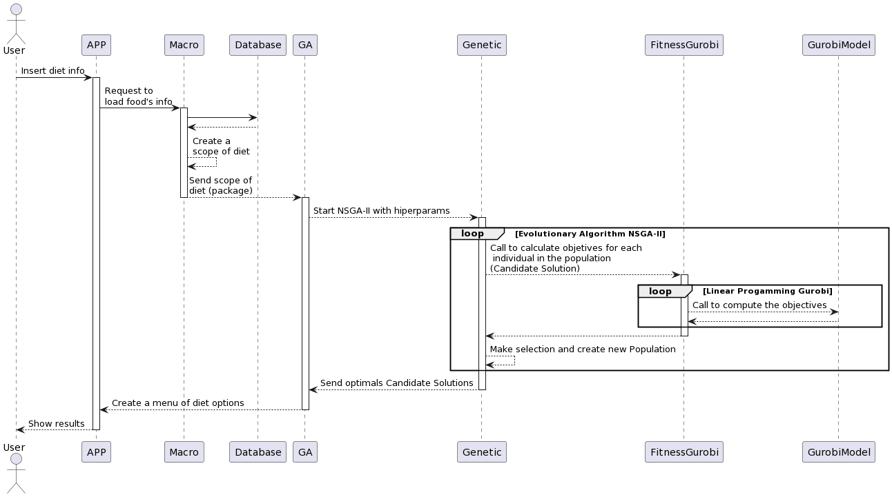

# dietprogram

Here is the main project folder. It's where everything happens.

## Description of Each File

| FILE | Description |
| --- | --- |
| app.py | Main File to Start the Program |
| database.py | Communication with Database |
| filtros.py |  User Filter Dataclass |
| fitnessGurobi.py | Class that updates the Individual's Objectives |
| formatConverter.py | Class that converts Individual chromosome data to Gurobi model |
| ga.py | Class that initializes NSAG-II |
| genetic.py | Class that contains all NSGA-II functionalities and operations |
| gurobyModel.py | Gurobi Model Structure Class - Mono Objective Linear Programming |
| individuo.py | NSGA-II Individual structure class |
| macro.py | Class that stores user and database information. PACKAGE |
| povo.py | NSGA-II People Structure Class |
| results.py | Class for generating graphs of NSGA-II results |

## Flow of information

Initialize the App (app.py) by command

> python3 app.py

1. App starts
   - App receives user data
   - If there are filters, it calls Filters (filters.py)
   - App calls Macro (macro.py) [2]
   - App calls GA (ga.py) [4]
2. Macro stores user data
   - Calls Database (database.py) [3]
   - Stores data in the database
3. Database receives requests from Macro
   - Communicates with the database
   - Delivers data to Macro
4. GA receives Macro
   - Retrieves Macro with stored data
   - Creates the initial population for the NSGA-II algorithm by calling Population (population.py) [6]
   - Initializes NSGA-II by calling Genetic (genetic.py) [5]
   - Receives results from Genetic
   - Prints the results
5. Genetic performs the NSGA-II algorithm
   - Utilizes its methods to conduct the search
   - Creates offspring for the Current Population by calling its methods and other classes [8] [7] [6] [4]
   - Calls FitnessGurobi (fitnessGurobi.py) [8] to calculate individual objectives
   - Executes the NSGA-II algorithm until the stopping criterion is met and returns results to GA
6. Population is called in both GA and Genetic
   - It creates individuals by calling Individual (individual.py) [7]
   - Depending on the call, it modifies the individuals' list and the individuals themselves
7. Individual is called in both Genetic and Population
   - Responsible for creating an individual's chromosome and updating its fitness value (objectives)
8. FitnessGurobi is called in both Genetic and GA
   - It performs the task of inserting the objectives of NSGA-II individuals
   - Calls FormatConverter (formatConverter.py) [9] to convert chromosome data
   - Calls GurobyModel (gurobyModel.py) [10] to perform the Linear Mono-Objective Programming calculation
   - Receives the NSGA-II objective "Cost" brought by GurobyModel
   - Calculates the second NSGA-II objective "Performance"
9. FormatConverter is called by FitnessGurobi
   - Responsible for converting chromosome data so that the Gurobi model can read this data
10. GurobyModel is called by FitnessGurobi
    - Receives all necessary parameters to create the mathematical model
    - Calculates and returns the results
    - Optionally, presents the data by calling the Results class

